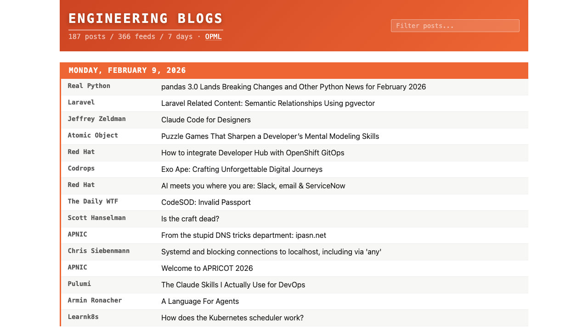

# Engineering Blogs Aggregator

[engineeringblogs.xyz](https://engineeringblogs.xyz/) aggregates posts from hundreds of engineering blogs into a single page, covering the past seven days. It's rebuilt every few hours automatically.

No accounts, no algorithms -- just a list of links with a quick filter to search through them.

> [!TIP]
> You can also just take the OPML file and use it in your own feed reader!

## Suggest a feed

Know a good engineering blog that's missing? [Open an issue](https://github.com/peterc/engblogs/issues/new?template=add-feed.yml) with the blog name and RSS/Atom feed URL, or edit `engblogs.opml` directly and submit a PR. New feeds show up on the site within minutes of merging.

## How it works

A Go script reads `engblogs.opml`, fetches every feed in parallel (with conditional GET to be polite), collects posts from the last 7 days, and renders a static HTML page. GitHub Actions runs this every 4 hours and deploys to GitHub Pages.

There's no database. Feed entries are ephemeral -- if a post falls outside the 7-day window, it's gone.

## Running locally

Requires Go 1.22+ and Python 3.

    make build    # fetch all feeds and generate public/index.html
    make render   # rebuild HTML from cache (no fetching, fast)
    make dev      # render and serve at http://localhost:8080
    make clean    # remove public/ and cache.json

## License

The feed list (`engblogs.opml`) is community-maintained. The rest of the code is MIT.
